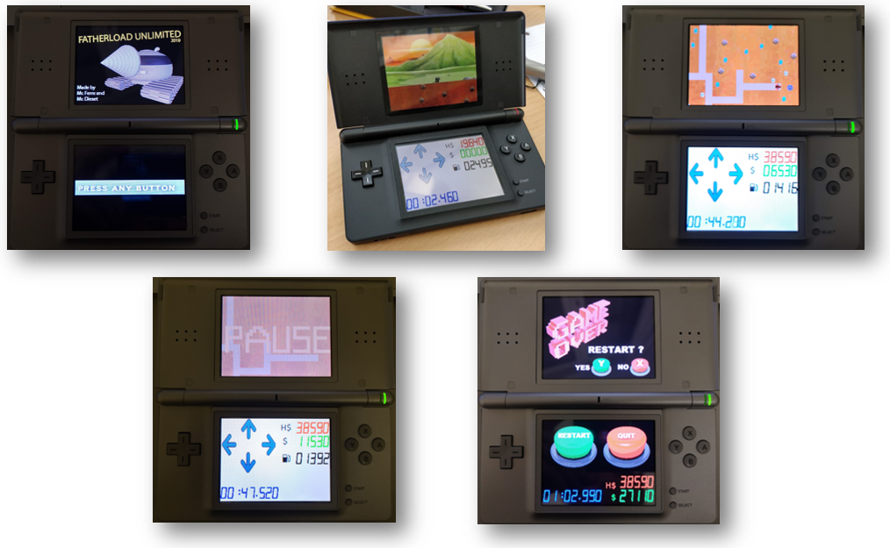
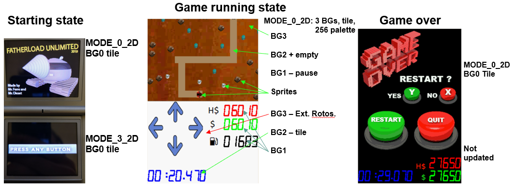

# Fatherload Unlimited 2019

Fatherload Unlimited 2019 is a nintendo DS game, a remake of the classic game Motherload Unlimited from the early 2000s. It is made as a project at EPFL, in the "Microprogrammed Embedded Systems" course. 

Some screenshots of the game:

The game is coded in c99 using the [libnds](https://github.com/devkitPro/libnds) library. The game has the following features:
- Timer / interrupts
- Tiled / pallette-based graphics
- Sprites for graphics
- Co-prosessor usage, both ARM7 and ARM9 CPUs are utilized in realtime. 
- D-pad, keypad and touchscreen inputs.
- Sound: background music and sound effects.
- Storage of highscore.

The graphics for the different states are combined as this figure shows.

Ext. Rotos. = extended rotoscale mode. 
